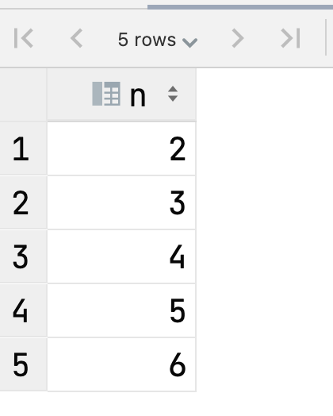
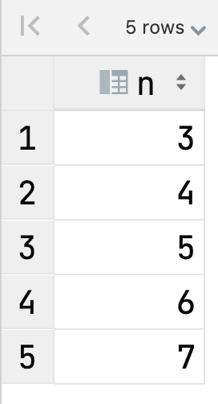

# Exercise 4 (advanced)

Given such sql statements:

```sql
PREPARE STMT FROM 'WITH L0 AS (SELECT c FROM (SELECT 1 as c UNION ALL SELECT 1) AS D),
     L1 AS (SELECT 1 AS c
            FROM L0 AS A
                     CROSS JOIN L0 AS B),
     L2 AS (SELECT 1 AS c
            FROM L1 AS A
                     CROSS JOIN L1 AS B),
     L3 AS (SELECT 1 AS c
            FROM L2 AS A
                     CROSS JOIN L2 AS B),
     L4 AS (SELECT 1 AS c
            FROM L3 AS A
                     CROSS JOIN L3 AS B),
     Nums AS (SELECT @i := @i+1 AS rownum FROM L4 AS O, (SELECT @i := 0) AS f)
SELECT ? + rownum - 1 AS n
FROM Nums
ORDER BY rownum LIMIT ?';

SET @low = 2;
SET @high = 6 - 2 + 1;
EXECUTE STMT USING @low, @high;
```

This prepared statement will return for you range of numbers:



* Encapsulate this prepared statement in *GetNums* procedure. Input parameters are *IN low BIGINT*, *IN high BIGINT*. Procedure must return result as Table with n as INT column
By executing this procedure with:

```sql
CALL GetNums(3, 7);
```

Desired result is:


